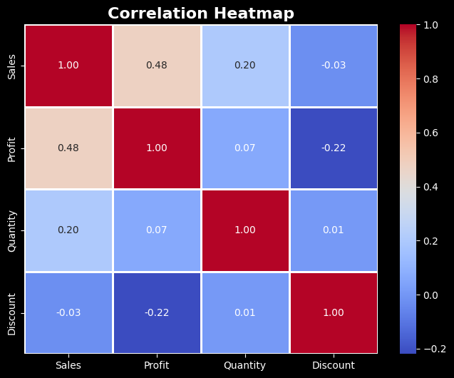

# 📊 EDA on Superstore Sales Dataset

## Overview

This project presents a comprehensive Exploratory Data Analysis (EDA) of the Superstore Sales Dataset using Python. The objective is to uncover meaningful business insights, identify sales and profit trends, evaluate regional performance, and support data-driven decision-making through visualization and statistical analysis.

---

## 🎯 Project Objectives

* Understand overall sales and profit performance
* Analyze category-wise and region-wise business trends
* Identify top-performing and loss-making products
* Study seasonal sales patterns
* Explore relationships between sales, profit, discount, and quantity
* Generate actionable business recommendations

---

## 🛠️ Tools & Technologies

* Python
* Pandas
* NumPy
* Matplotlib
* Seaborn
* Jupyter Notebook

---

## 📂 Dataset Information

The Superstore dataset contains transactional sales records including:

* Orders and shipping details
* Customer information
* Product categories and sub-categories
* Sales and profit metrics
* Regional and geographical information
* Discounts and quantities sold

---

## 📈 Analysis Performed

### Data Exploration

* Dataset Overview
* Data Types Analysis
* Dataset Dimensions
* Statistical Summary

### Data Cleaning

* Missing Value Analysis
* Duplicate Detection & Removal

### Business Analysis

* KPI Analysis
* Sales by Category
* Profit by Category
* Sales by Region
* Profit by Region
* Monthly Sales Trend
* Top 10 Products by Sales
* Sales vs Profit Relationship
* Correlation Analysis
* Top 5 Loss-Making Products
* Sales Distribution Analysis

---

## 🔑 Key Insights

### Category Performance

* Technology generated the highest sales and profit.
* Furniture showed strong sales but relatively lower profitability.

### Regional Performance

* The West region recorded the highest sales and profit.
* Central and South regions showed comparatively lower profitability.

### Sales Trends

* Sales peaked during November and December, indicating seasonal demand.
* Early-year sales were comparatively lower.

### Profitability Factors

* Discounts negatively impacted profit.
* Sales and profit showed a moderate positive correlation.

### Product Analysis

* Several products consistently generated losses despite generating revenue.
* High-performing products contributed significantly to total sales.

---

## 📷 Project Visualizations

### Sales by Category

### Profit by Category

### Sales by Region

### Profit by Region

### Monthly Sales Trend

### Sales vs Profit Analysis

### Correlation Heatmap

### Top 5 Loss-Making Products

---

## 💡 Business Recommendations

* Increase focus on high-performing Technology products.
* Optimize discount strategies to improve profitability.
* Review pricing and operational costs of loss-making products.
* Prepare inventory and marketing campaigns for peak sales months.
* Apply successful strategies from the West region to underperforming regions.

---

## 📌 Conclusion

This Exploratory Data Analysis project transformed raw sales data into meaningful business insights through data cleaning, visualization, and statistical analysis. The findings can support better decision-making in sales planning, inventory management, pricing strategies, and overall business growth.

---

## 👨‍💻 Author

**Sabir Shaikh**

B.Sc. Computer Science Student

